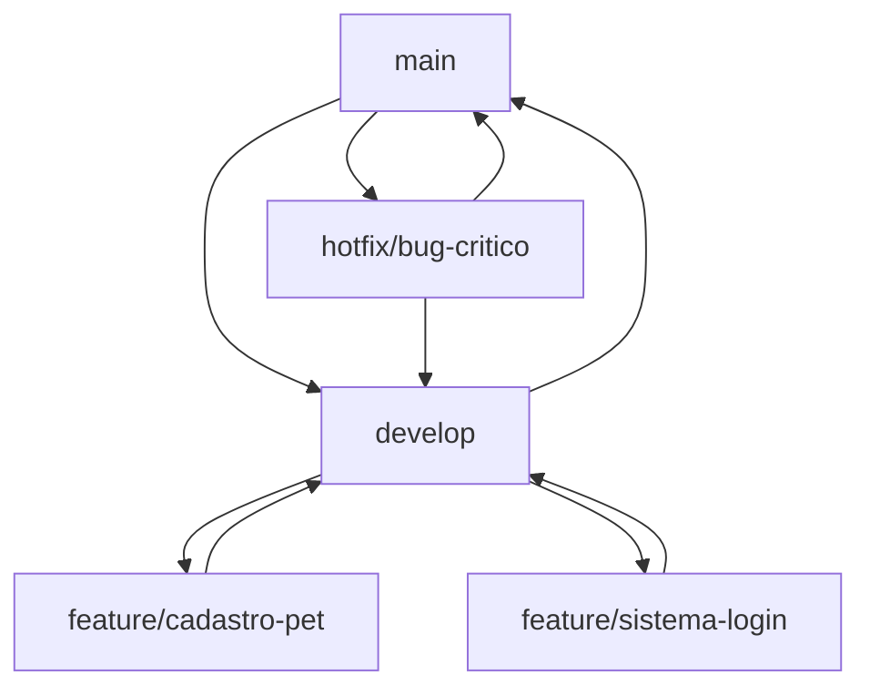

# 🎓 Curso Git & GitHub - Equipe Carteira Digital Pet

**PJI110 - UNIVESP 2026**  
**Projeto:** https://github.com/Acting24/carteira-pet-digital  
**Data:** 29/03/2026

---

## 🎯 **Objetivo do Curso**

Este curso vai ensinar os **7 integrantes** da equipe a trabalhar colaborativamente no projeto **Carteira Digital Pet** usando Git e GitHub de forma segura e eficiente.

---

## 👥 **Nossa Equipe (7 Pessoas)**

| Nome | Email | GitHub | Papel Principal |
|------|-------|--------|----------------|
| **Adilson Lucas da Silva** | 24205869@aluno.univesp.br | Acting24 | 🎯 Líder/Repository Owner |
| **David Wilames Nunes Batista** | 23217049@aluno.univesp.br | ? | 🏗️ Arquiteto/Tech Lead |
| **Helton Silva de Almeida** | 24209102@aluno.univesp.br | ? | ⚙️ Desenvolvedor Backend |
| **Lucas Pereira de Lima** | 24214565@aluno.univesp.br | ? | 🗄️ Especialista BD |
| **Thaise Michelaine Nunes de Oliveira** | 24219760@aluno.univesp.br | ? | 🎨 Desenvolvedora Frontend/UX |
| **Vanessa de Pádua Nunes Fusco Parisi** | 24219706@aluno.univesp.br | ? | 👥 UX Researcher |
| **Vanessa Dias Fernandes** | 24202074@aluno.univesp.br | ? | 📚 Documentadora/QA |

---

## 📚 **MÓDULO 1: Primeiros Passos**

### **🔧 1.1 Instalação e Configuração**

#### **Windows (Maioria da equipe):**
```bash
# 1. Baixar e instalar Git
https://git-scm.com/downloads

# 2. Verificar instalação
git --version

# 3. Configurar identidade (IMPORTANTE!)
git config --global user.name "Seu Nome Completo"
git config --global user.email "seu.email@aluno.univesp.br"

# 4. Verificar configuração
git config --list
```

#### **Configuração Recomendada:**
```bash
# Editor padrão (opcional)
git config --global core.editor "code --wait"

# Configurar line endings (Windows)
git config --global core.autocrlf true

# Melhorar visualização
git config --global color.ui auto
```

### **🔗 1.2 Aceitar Convite do GitHub**

1. **Verificar email** - Procurar convite do GitHub
2. **Clicar no link** do convite
3. **Aceitar convite** para o repositório
4. **Confirmar acesso** em: https://github.com/Acting24/carteira-pet-digital

---

## 📚 **MÓDULO 2: Clonando o Projeto**

### **🔽 2.1 Clone Inicial**

```bash
# 1. Navegar para pasta de trabalho
cd C:\Users\[SEU_USUARIO]\Documents

# 2. Clonar repositório
git clone https://github.com/Acting24/carteira-pet-digital.git

# 3. Entrar no projeto
cd carteira-pet-digital

# 4. Verificar arquivos
ls
```

### **📁 2.2 Entendendo a Estrutura**

```
carteira-pet-digital/
├── 📚 docs/                    # Documentação do projeto
│   ├── requisitos/             # Análise de requisitos
│   ├── wireframes/             # Protótipos (a fazer)
│   ├── diagramas/              # ER e arquitetura
│   └── design_thinking/        # Artefatos DT
│
├── 🥇 django_app/              # IMPLEMENTAÇÃO DJANGO (Principal)
│   ├── carteira_pet/           # Configurações Django
│   └── apps/                   # Apps modulares
│       ├── core/               # Models: Usuario, Tutor, Veterinario
│       ├── pets/               # Models: Pet, Especie
│       └── vacinas/            # Models: Vacina
│
├── 🥈 src/                     # IMPLEMENTAÇÃO FLASK (Alternativa)
│   └── app/                    # Estrutura Flask
│       ├── models/             # SQLAlchemy models
│       ├── routes/             # Blueprints
│       ├── templates/          # HTML templates
│       └── static/             # CSS/JS
│
├── 📖 README.md                # Manual completo do projeto
├── 📋 GUIA_DE_UTILIZACAO.md    # Como usar os arquivos
├── 🔐 CREDENCIAIS_EQUIPE.md    # Template para preencher
├── 🎓 CURSO_GIT_GITHUB_EQUIPE.md # Este curso!
│
├── 📦 requirements-django.txt   # Dependências Django
├── 📦 requirements.txt         # Dependências Flask
├── ⚙️ config.py               # Configurações
├── 🚀 run.py                  # Executar Flask
└── 🙈 .gitignore              # Arquivos ignorados
```

---

## 📚 **MÓDULO 3: Workflow da Equipe**

### **🌿 3.1 Sistema de Branches**

#### **Branches Principais:**
- **`main`** - Código de produção (só commits testados!)
- **`develop`** - Integração das funcionalidades
- **`feature/nome-funcionalidade`** - Novas funcionalidades
- **`bugfix/nome-bug`** - Correção de bugs
- **`hotfix/nome-emergencial`** - Correções urgentes

#### **Convenção de Nomes:**
```bash
# Exemplos de branches
feature/cadastro-pet
feature/sistema-login
feature/upload-fotos
bugfix/erro-idade-pet
hotfix/falha-banco-dados
docs/atualizacao-readme
```

### **🔄 3.2 Fluxo de Trabalho (GitFlow)**



### **⚡ 3.3 Comandos Essenciais do Dia a Dia**

#### **🔄 Sincronização (TODO DIA!):**
```bash
# 1. Baixar atualizações do GitHub
git fetch origin

# 2. Mudar para branch principal
git checkout main

# 3. Atualizar com mudanças remotas
git pull origin main

# 4. Mudar para develop
git checkout develop

# 5. Atualizar develop
git pull origin develop
```

#### **🌿 Criando Nova Funcionalidade:**
```bash
# 1. Partir do develop atualizado
git checkout develop
git pull origin develop

# 2. Criar branch para sua funcionalidade
git checkout -b feature/cadastro-pet

# 3. Trabalhar normalmente...
# (fazer edições nos arquivos)

# 4. Adicionar arquivos modificados
git add .

# 5. Fazer commit com mensagem clara
git commit -m "feat(pets): adiciona formulário de cadastro

- Implementa validação de dados
- Adiciona upload de foto
- Inclui seleção de espécie
- Testes unitários incluídos

PJI110-UNIVESP-2026"

# 6. Enviar para GitHub
git push origin feature/cadastro-pet
```

#### **🔄 Pull Request (Integração):**
1. **Ir ao GitHub** após push da branch
2. **Clicar "Compare & Pull Request"**
3. **Preencher descrição** detalhada
4. **Marcar revisor** (outro membro da equipe)
5. **Aguardar aprovação** antes de merge

---

## 📚 **MÓDULO 4: Convenções da Equipe**

### **📝 4.1 Mensagens de Commit**

#### **Formato Padrão:**
```
tipo(escopo): descrição curta

- Detalhe 1
- Detalhe 2
- Detalhe 3

PJI110-UNIVESP-2026
```

#### **Tipos de Commit:**
- **`feat`** - Nova funcionalidade
- **`fix`** - Correção de bug
- **`docs`** - Documentação
- **`style`** - Formatação (sem mudança de lógica)
- **`refactor`** - Refatoração de código
- **`test`** - Adição/modificação de testes
- **`chore`** - Tarefas de manutenção

#### **Exemplos Bons:**
```bash
feat(auth): adiciona sistema de login

- Implementa autenticação com email/senha
- Adiciona validação de campos
- Inclui redirecionamento após login
- Testes de integração incluídos

PJI110-UNIVESP-2026
```

```bash
fix(pets): corrige cálculo de idade

- Resolve bug de anos bissextos
- Melhora precisão do cálculo
- Adiciona validação de data futura

PJI110-UNIVESP-2026
```

```bash
docs(readme): atualiza instruções de instalação

- Adiciona seção para Windows
- Melhora exemplos de comandos
- Corrige links quebrados

PJI110-UNIVESP-2026
```

### **🔍 4.2 Code Review (Revisão de Código)**

#### **Processo:**
1. **Autor** cria Pull Request
2. **Revisor** analisa código
3. **Comentários** de melhoria
4. **Correções** se necessário
5. **Aprovação** e merge

#### **Checklist do Revisor:**
- ✅ Código funciona corretamente?
- ✅ Segue padrões do projeto?
- ✅ Está bem documentado?
- ✅ Tem testes adequados?
- ✅ Não quebra funcionalidades existentes?

### **📋 4.3 Responsabilidades por Área**

#### **🏗️ Django (Backend Principal):**
- **Responsável:** Helton Silva + Lucas Pereira
- **Path:** `django_app/`
- **Foco:** Models, Views, APIs

#### **🎨 Frontend/Templates:**
- **Responsável:** Thaise Michelaine + Vanessa de Pádua  
- **Path:** `django_app/apps/*/templates/` + `src/app/static/`
- **Foco:** Interface, UX, CSS, JavaScript

#### **📚 Documentação:**
- **Responsável:** Vanessa Dias + David Wilames
- **Path:** `docs/`, `*.md`
- **Foco:** Guides, README, especificações

#### **🏛️ Arquitetura:**
- **Responsável:** David Wilames + Adilson Lucas
- **Path:** Configurações gerais, estrutura
- **Foco:** Decisões técnicas, code review

---

## 📚 **MÓDULO 5: Cenários Comuns**

### **🚨 5.1 Conflitos de Merge**

#### **Quando acontecem:**
- Duas pessoas editam o mesmo arquivo
- Mudanças nas mesmas linhas
- Git não consegue mesclar automaticamente

#### **Resolução:**
```bash
# 1. Tentar merge/pull
git pull origin develop
# ❌ CONFLICT (content): Merge conflict in arquivo.py

# 2. Abrir arquivo com conflito
# Procurar por marcadores:
<<<<<<< HEAD
Sua mudança
=======
Mudança do colega
>>>>>>> branch-name

# 3. Resolver manualmente, escolher versão final:
Versão final combinada

# 4. Marcar como resolvido
git add arquivo.py

# 5. Finalizar merge
git commit -m "resolve: conflito em arquivo.py"
```

### **🔄 5.2 Sincronizando com Equipe**

#### **Comando Diário (TODO DIA!):**
```bash
# Script para rodar toda manhã
git checkout main
git pull origin main
git checkout develop  
git pull origin develop
git checkout feature/sua-branch
git merge develop  # Traz mudanças da equipe
```

### **💾 5.3 Salvando Trabalho Temporário**

```bash
# Se precisa mudar de branch rapidamente
git stash push -m "trabalho em progresso na tela de login"

# Mudar de branch e trabalhar...
git checkout outra-branch

# Voltar e recuperar trabalho
git checkout sua-branch
git stash pop
```

### **🔙 5.4 Desfazendo Mudanças**

```bash
# Desfazer mudanças não commitadas
git checkout -- arquivo.py

# Desfazer último commit (mantém mudanças)
git reset HEAD~1

# Desfazer commit específico
git revert abc1234

# Ver histórico para debug
git log --oneline --graph
```

---

## 📚 **MÓDULO 6: Ferramentas e Dicas**

### **🛠️ 6.1 Visual Studio Code (Recomendado)**

#### **Extensões Essenciais:**
- **GitLens** - Visualização avançada do Git
- **Git Graph** - Árvore visual de commits
- **Python** - Suporte a Python/Django
- **Django** - Templates e sintaxe Django

#### **Configuração VSCode:**
```json
{
  "git.autofetch": true,
  "git.confirmSync": false,
  "git.enableSmartCommit": true,
  "editor.formatOnSave": true
}
```

### **🖥️ 6.2 Comandos Úteis**

#### **Status e Informações:**
```bash
git status              # Estado atual
git log --oneline -10   # Últimos 10 commits
git branch -a           # Todas as branches
git diff                # Mudanças não commitadas
git diff HEAD~1         # Comparar com commit anterior
```

#### **Limpeza e Manutenção:**
```bash
git clean -f            # Remover arquivos não rastreados
git branch -d nome      # Deletar branch local
git remote prune origin # Limpar branches remotas deletadas
```

### **🔧 6.3 Aliases Úteis**

```bash
# Configurar aliases para agilizar
git config --global alias.co checkout
git config --global alias.br branch
git config --global alias.ci commit
git config --global alias.st status
git config --global alias.unstage 'reset HEAD --'
git config --global alias.last 'log -1 HEAD'
git config --global alias.visual '!gitk'
```

---

## 📚 **MÓDULO 7: Boas Práticas da Equipe**

### **✅ 7.1 DO (Faça Isso)**

1. **📅 Sincronize TODO DIA** antes de começar
2. **🌿 Use branches** para cada funcionalidade
3. **📝 Commits pequenos** e frequentes
4. **💬 Mensagens claras** nos commits
5. **🔍 Revise código** dos colegas
6. **🧪 Teste** antes de fazer push
7. **📖 Documente** mudanças importantes
8. **💬 Comunique** no WhatsApp sobre mudanças grandes

### **❌ 7.2 DON'T (Evite Isso)**

1. **❌ Commit direto na main** (use branches!)
2. **❌ Push sem testar** código
3. **❌ Commits gigantes** (quebre em partes)
4. **❌ Mensagens vagas** ("fix", "update")  
5. **❌ Ignorar conflitos** (resolva adequadamente)
6. **❌ Trabalhar sem sincronizar** (causa conflitos)
7. **❌ Deletar arquivos** dos colegas sem avisar
8. **❌ Fazer merge** sem aprovação

### **🚨 7.3 Regras CRÍTICAS**

#### **🔒 MAIN Branch - SUPER PROTEGIDA:**
- ⛔ **NUNCA** commit direto na main
- ⛔ **NUNCA** force push na main  
- ⛔ **NUNCA** merge sem review
- ✅ **SEMPRE** via Pull Request
- ✅ **SEMPRE** com aprovação de 2 pessoas

#### **🔄 DEVELOP Branch - CONTROLADA:**
- ⚠️ **Preferir** Pull Request
- ⚠️ **Testar** antes de merge
- ✅ **OK** pequenos fixes diretos
- ✅ **OK** merges de features

---

## 📚 **MÓDULO 8: Emergências e Troubleshooting**

### **🆘 8.1 Socorro! Fiz Algo Errado!**

#### **Problema: Commit na branch errada**
```bash
# Se ainda não fez push:
git reset HEAD~1          # Desfaz commit
git checkout branch-certa # Muda para branch correta
git add .                 # Adiciona mudanças
git commit -m "mensagem"  # Commit na branch certa
```

#### **Problema: Deletei arquivo por engano**
```bash
git checkout HEAD -- arquivo.py  # Recupera do último commit
```

#### **Problema: Quero desfazer tudo e recomeçar**
```bash
git stash                # Salva mudanças
git checkout main        # Volta para main
git pull origin main     # Atualiza
git checkout -b nova-branch  # Recomeça limpo
```

### **🔧 8.2 Comandos de Emergência**

```bash
# Ver o que mudou
git diff HEAD~1

# Voltar arquivo específico para versão anterior
git checkout HEAD~1 -- arquivo.py

# Ver quem mudou cada linha (debug)
git blame arquivo.py

# Procurar texto no histórico
git log -S "texto_procurado"
```

### **📞 8.3 Quando Pedir Ajuda**

**⚠️ PARE e peça ajuda se:**
- Apareceu uma tela estranha que não entende
- Git está pedindo para resolver conflitos e não sabe como
- Perdeu código importante
- Não consegue fazer push/pull
- Apareceu erro que não entende

**👥 Canais de Ajuda:**
1. **WhatsApp do grupo** (primeiro socorro)
2. **Adilson Lucas** (repository owner)
3. **David Wilames** (tech lead)

---

## 📚 **MÓDULO 9: Plano de Treinamento**

### **📅 9.1 Cronograma de Aprendizado**

#### **Semana 1 - Fundamentos (Todos):**
- [ ] Instalar Git e configurar
- [ ] Aceitar convite e clonar repositório  
- [ ] Ler documentação (README.md)
- [ ] Fazer primeiro commit simples

#### **Semana 2 - Workflow (Todos):**
- [ ] Criar primeira branch
- [ ] Fazer commit seguindo convenções
- [ ] Criar primeiro Pull Request
- [ ] Fazer code review de colega

#### **Semana 3 - Especialização (Por Área):**
- **Backend:** Trabalhar em `django_app/`
- **Frontend:** Trabalhar em templates/static
- **Docs:** Atualizar documentação
- **Arquitetura:** Code review e decisões técnicas

### **🎯 9.2 Exercícios Práticos**

#### **Exercício 1: Primeiro Commit**
```bash
# Objetivo: Cada pessoa atualiza CREDENCIAIS_EQUIPE.md com seus dados
1. git checkout -b docs/meus-dados
2. Editar CREDENCIAIS_EQUIPE.md (adicionar suas informações)
3. git add CREDENCIAIS_EQUIPE.md
4. git commit -m "docs(equipe): adiciona dados de [SEU NOME]"
5. git push origin docs/meus-dados
6. Criar Pull Request no GitHub
```

#### **Exercício 2: Funcionalidade Simples**
```bash
# Objetivo: Adicionar comentário simples em arquivo Python
1. git checkout develop
2. git pull origin develop
3. git checkout -b feature/comentario-[seunome]
4. Editar arquivo Python (adicionar comentário/docstring)
5. Commit e push seguindo convenções
6. Pull Request com revisor
```

### **📊 9.3 Métricas de Sucesso**

**✅ Todos devem conseguir:**
- [ ] Clonar repositório
- [ ] Criar branch
- [ ] Fazer commit
- [ ] Enviar Pull Request
- [ ] Fazer code review

**🏆 Objetivos avançados:**
- [ ] Resolver conflito de merge
- [ ] Usar stash efetivamente  
- [ ] Fazer rebase simples
- [ ] Contribuir regularmente

---

## 📚 **MÓDULO 10: Recursos e Referências**

### **📖 10.1 Documentação Essencial**

#### **Nosso Projeto:**
- **README.md** - Manual completo do projeto
- **GUIA_DE_UTILIZACAO.md** - Como usar os arquivos criados
- **CREDENCIAIS_EQUIPE.md** - Template para preencher dados

#### **Git & GitHub:**
- [Git Documentation](https://git-scm.com/docs)
- [GitHub Guides](https://guides.github.com/)
- [Atlassian Git Tutorials](https://www.atlassian.com/git/tutorials)

### **🛠️ 10.2 Ferramentas Complementares**

#### **Clientes Git Visuais (Opcional):**
- **SourceTree** (Atlassian) - Gratuito
- **GitKraken** - Visual e intuitivo  
- **GitHub Desktop** - Simples e integrado

#### **Editores Recomendados:**
- **Visual Studio Code** (Recomendado)
- **PyCharm** (Para Python/Django)
- **Sublime Text** (Leve)

### **📱 10.3 Apps Mobile (Monitoramento)**

- **GitHub Mobile** - Notifications e reviews
- **Working Copy** (iOS) - Git client
- **MGit** (Android) - Git client

---

## 🎓 **Certificação da Equipe**

### **📋 Checklist de Competências**

**Para cada membro da equipe:**

#### **✅ Nível Básico (Obrigatório):**
- [ ] Git instalado e configurado
- [ ] Convite GitHub aceito
- [ ] Repositório clonado localmente
- [ ] Primeiro commit realizado
- [ ] Branch criada
- [ ] Pull Request submetido
- [ ] Code review realizado

#### **🏆 Nível Intermediário (Desejável):**
- [ ] Conflito de merge resolvido
- [ ] Stash utilizado adequadamente
- [ ] Rebase básico executado
- [ ] 10+ commits no projeto
- [ ] 3+ Pull Requests aprovados
- [ ] 5+ Code reviews realizados

#### **🚀 Nível Avançado (Opcional):**
- [ ] Git aliases configurados
- [ ] Comandos avançados (cherry-pick, bisect)
- [ ] Workflow automatizado
- [ ] Mentoria de outros membros
- [ ] Contribuição em documentação
- [ ] Liderança técnica

---

## 🏁 **Conclusão e Próximos Passos**

### **🎯 Objetivos Alcançados**

Após este curso, nossa equipe terá:
- ✅ **Workflow colaborativo** funcional
- ✅ **Padrões de qualidade** estabelecidos
- ✅ **Comunicação técnica** eficiente
- ✅ **Controle de versão** profissional
- ✅ **Backup automático** do código
- ✅ **Histórico completo** das mudanças

### **📈 Métricas de Sucesso do Projeto**

**Quinzena 2-3:**
- 🎯 **100% da equipe** usando Git diariamente
- 🎯 **50+ commits** no repositório
- 🎯 **20+ Pull Requests** processados
- 🎯 **Zero conflitos** não resolvidos

**Quinzena 4-8:**
- 🎯 **Sistema Django/Flask** funcionando
- 🎯 **Código 100% versionado**
- 🎯 **Documentação atualizada**
- 🎯 **Testes automatizados**

### **🚀 Evolução Contínua**

**Nossa equipe vai crescer em:**
- **👨‍💻 Habilidades técnicas** (Git, Python, Web Development)
- **🤝 Colaboração** (Code Review, Pair Programming)
- **📋 Organização** (Project Management, Documentation)
- **🔍 Qualidade** (Testing, Best Practices)

---

## 📞 **Suporte e Contatos**

### **🆘 Canais de Ajuda**

#### **🔴 Emergências (Perdi código, erro grave):**
- **WhatsApp Grupo:** Resposta imediata
- **Adilson Lucas:** Repository Owner

#### **🟡 Dúvidas Técnicas:**
- **David Wilames:** Tech Lead
- **WhatsApp Grupo:** Discussão em equipe
- **Issues GitHub:** Para problemas documentados

#### **🟢 Sugestões e Melhorias:**
- **Vanessa Dias:** Documentação
- **Pull Request:** Para melhorias no workflow

### **📚 Recursos Finais**

**📖 Documentação Sempre Atualizada:**
- Este curso será atualizado conforme evoluímos
- README.md tem informações técnicas detalhadas  
- Issues no GitHub para discussion específicas

**🎯 Lembre-se:**
> **"O Git é nossa ferramenta de trabalho colaborativo. Dominando-o, nossa equipe será mais eficiente, organizada e profissional. Vamos transformar este projeto em um caso de sucesso!"**

---

## 🏆 **Mensagem Final**

### **Para Nossa Equipe Incrível:**

**Parabéns por chegarem até aqui!** 🎉

Vocês agora têm em mãos:
- ✅ **Projeto estruturado** profissionalmente  
- ✅ **Ferramentas modernas** de desenvolvimento
- ✅ **Conhecimento técnico** para trabalhar em equipe
- ✅ **Documentação completa** para consulta
- ✅ **Workflow padronizado** e eficiente

### **🎯 O Sucesso está nas nossas mãos:**

**"Somos 7 pessoas com UM objetivo: criar o melhor sistema de Carteira Digital Pet da UNIVESP 2026!"**

**Tecnologias que dominamos:**
- 🐍 **Python** (Django/Flask)
- 🌐 **Web Development** (HTML/CSS/JS)
- 🗃️ **Banco de Dados** (MySQL/SQLite)
- 🔧 **Git/GitHub** (Colaboração)
- 📋 **Project Management** (Metodologia DT)

### **💪 Compromisso da Equipe:**

- **🤝 Colaboração:** Ajudamos uns aos outros
- **📚 Aprendizado:** Crescemos juntos
- **🎯 Qualidade:** Entregamos o melhor
- **⏰ Pontualidade:** Respeitamos prazos
- **💬 Comunicação:** Mantemos todos informados

---

**🚀 PROJETO CARTEIRA DIGITAL PET - RUMO AO SUCESSO! 🚀**

**PJI110 - UNIVESP 2026**  
**Equipe de Excelência ✨**

---

> **Desenvolvido com dedicação por Adilson Lucas da Silva**  
> **Co-Authored-By: Oz <oz-agent@warp.dev>**

**📅 Data:** 29/03/2026  
**📊 Versão:** 1.0  
**🎯 Status:** Pronto para uso da equipe!